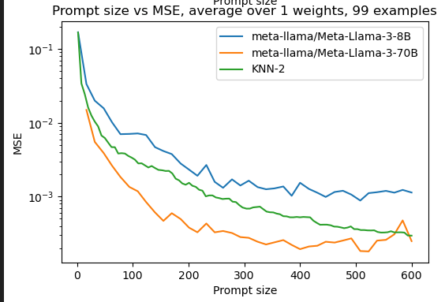

## 0. Setting
We prompt LLMs to do linear regression in-context
### 0.1. Models
- Llama 3 8B, 70B
    - Max context length: 8192
- Claude Haiku 3 & Sonnet 3.5
    - Max context length: 20000
### 0.2. Linear regression model
- No noise, no bias, bounded integer inputs and weight
- $y=Xw$, where $X=(x_1,\dots,x_n) \in \mathbb{Z}^{d\times n}$, $w \in \mathbb{Z}^d$, $y \in \mathbb{R}^n$
- Constraints: $(X)_{ij} \in [0, 1000]$, $w_i \in [0, 1000]$
- Dimension $d$ either 2 or 4 to vary the diffculty

### 0.3. Constructing the prompt
- In each trial, we have a fixed $d$ and $w$. We sample $X$ and $y$ from the linear model. We then prompt the model with and ask it to predict the next number in the sequence. We then compute the mean squared error (MSE) between the model's prediction and the true value. 
    - Note every time we sample a dataset $X$, the last example $x_n$ is the prompt to the model, and we keep it the same across all datasets samples in a trial. 
- Example: $d=4$
    - Prompt
        ```
            x=37, 16, 829, 576; y=685406
            x=83, 874, 925, 6; y=809168
            x=566, 966, 974, 322; y=1489036
            ...
            x=8, 645, 292, 476; y=616271
            x=378, 692, 529, 418; y=1062419
            x=563, 679, 5, 101; y=
        ```
    - Answer
        ```
            1062419
        ```
- For instruction tuned models we add a system prompt in the beginning
    ```
    Find the answer given the existing datapoints. Respond with only an integer valued answer and nothing else. Do not include any explanations.
    ```


### Hypothesis 1: LLMs solve the linear regression problem by doing some variant of nearest neighbor, by attending to a few examples in the context.
- [ ] Compare Llamas with KNN
- [ ] Corrupt examples one by one and see which ones affect the prediction
- [ ] Shuffle the examples 
## Hypothesis 2: Instruction-tuned models solve linear regression differenly than non-instruction tuned counterparts.
- [ ] Compare Llamas with and without instruction tuning
## Hypothesis 3: The "complexity" of the function induced by the context increases monotonically with the length of the context.
- [ ] Meaure sensitivity
- [ ] Long context "ascent" phenomenon


### 1.1 Over a single trial

- Within a single dataset sample, the MSE fluctuates a lot
    - Note that as we increase the context length from $p$ to $p'$, the first $p$ examples remains the same. 
- This is not unlike the behavior of KNN

### 1.2 Over multiple trials
- Average over multiple runs reduces non-monotonicity of MSE
- Larger models have a lower error floor
- MSE does not decrease monotonically with length of context
- In the long-context regime, the MSE does not decrease

### 1.2 Comparison with KNN

- Llama models MSE decays like KNN
    - Llama 3 8B is an order of magnitude worse than KNN
    - Llama 3 70B is an order of magnitude better than KNN
- Sonnet 3.5 much better than KNN, converges way faster

### 1.3. Decompose the error into bias and variance
- MSE is dominated by variance in Llama, but not in Sonnet


<!-- ### 1.4 [WIP] Plot the entire 1000x1000 range of inputs - any patterns? -->

<!-- ## 3. Sensitivity: how much the output change with a small change in the input
- [ ] +-1 in one number in the demonstration
- [ ] +-1 in one number in the question (last example)
- [ ] change one example in the demonstration
- [ ] change the question
- Shuffling the demonstrations -->

## 4. Possible explanations
- Is the model doing some variant of nearest neighbor?

## 5. Remedies
- Finetuning on linear regression

## TODOs
- [ ] just do single sample batch for everything, its cleaner
